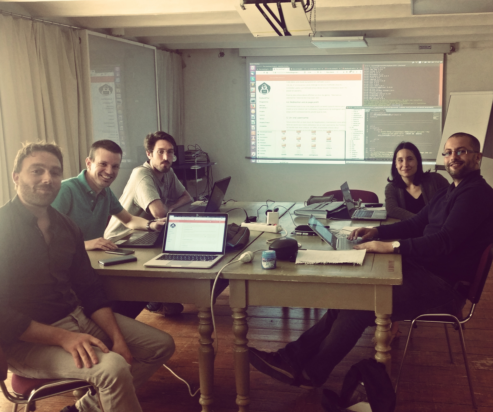

# BDonRails
Créations d'app Ruby on Rails

-------------

# Introduction : Présentation de l'équipe

## ** WEST COAST MARSEILLE**
##- Audrey (@audreycouture)

##- Jerome (@Jerome)

##- Damien (@damien13005)

##- Maxime (@Maxime)

##- Sam 	(@sam)

##Fait en pair programming

-------------

# But de l´exercice

Pour ce jeudi 26 avril 2018 dans le cadre de la découverte de Ruby on Rails, nous devions créer deux app en local. l'une en static page qui présente notre équipe et chaque membre du pair programming et l'autre en dynamique avec la création de pages users personnalisées via une base de données.

------------

# Consignes d'utilisation

Pour ouvrir chaque app et la tester il faut downloader le dossier, se placer dedans dans votre terinal et lancer en commande:

> $ bundle install

Puis taper la commande:

> $ rails server

Pour voir la base données exécuter en commande un

> $ rails db:create

ou

> $ rails db:migrate

Puis ouvrir le fichier sqlite dans le dossier db de l'app, soit avec dbBrowser soit avec SqliteStudio ou autre et visionner.

------------

# Résultats
1. Exo en static complet
1.2.3.4. App rail contenant neufs pages:
- localhost:3000  => Home en racine
- localhost:3000/contact
- localhost:3000/about
- localhost:3000/about/team
- localhost:3000/about/jerome
- localhost:3000/about/damien
- localhost:3000/about/audrey
- localhost:3000/about/samir
- localhost:3000/about/maxime

2. Backend => complété jusqu'à 4.2 inclu (manque username et validations)
- model User avec username et bio
- root page d'accueil
- page de création d'utlisateur (post)
- méthode new pour création d'utilisateur
- formulaire HTML (username et bio)
- redirection vers la page profil peronnalisée du user via l'id

Merci pour la correction ! 
